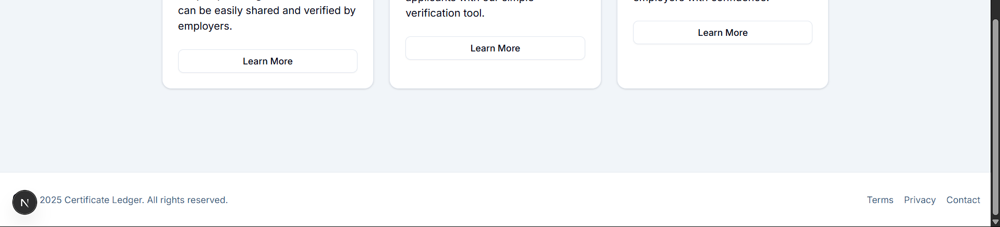
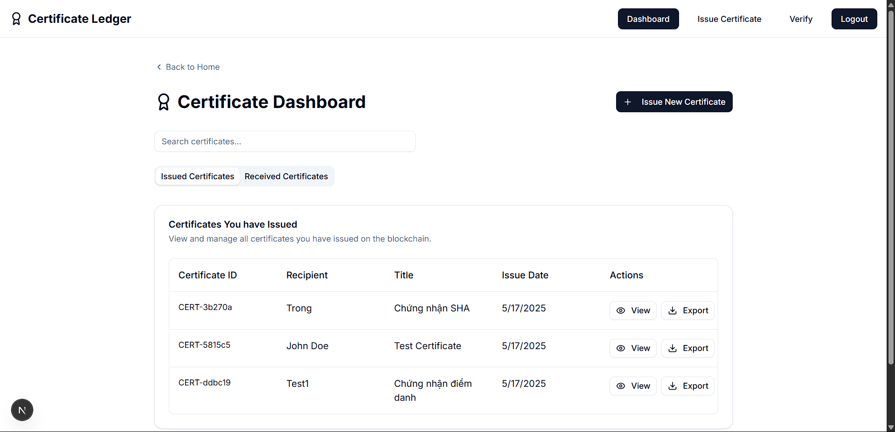

# CERTIFICATE-LEDGER

## Overview

**CERTIFICATE-LEDGER** is a demo project aimed at solving a practical problem using distributed ledger technology (DLT). Having previously worked on blockchain and cryptocurrency projects, our team encountered a major issue — high gas fees on public blockchain networks. This cost barrier made it difficult for student-level projects to be deployed in real-world scenarios. As a result, we decided to redirect our efforts toward a more practical use case that still leverages the power of blockchain: **Certificate Management and Verification**.

## Purpose

The primary goals of the CERTIFICATE-LEDGER project are:

- To manage digital certificates transparently and verifiably to prevent fraud.
- To build a decentralized and tamper-resistant certificate issuance system.
- To minimize the risk of forged certificates in recruitment or academic evaluation processes.
- To make it easy for institutions to issue certificates and for recipients to share or verify them.

## How It Works

- **Administrators** can create and issue certificates to users.
- **Users** can log in to the system to view their certificates.
- The system simulates blockchain technology by storing data in a block-chain-like structure on the backend, ensuring data integrity.
- All certificate data is immutable once issued.

## Technology Stack

- **Backend**: Go (Golang) – handles core logic, APIs, and data storage.
- **Frontend**: React with TypeScript – provides a smooth and modern user interface.
- **Architecture**: RESTful API – with potential for future expansion to decentralized storage systems.

### UI

#### Home

#### Login

#### Register

#### Dashboard

#### Issue Certificate

#### Verify

